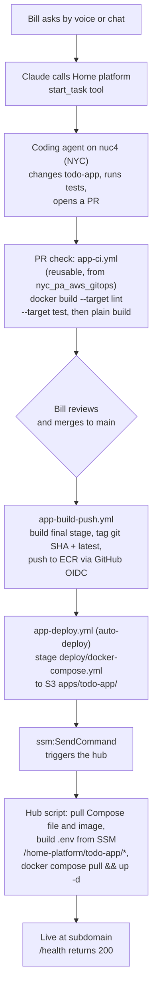
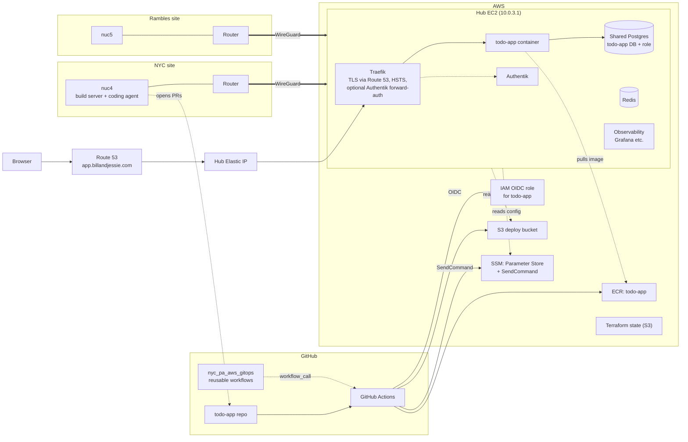

# Architecture

This page shows how a change to todo-app travels from a spoken or typed request to a live deploy, and which pieces of infrastructure it runs on. The app follows the home platform's app contract; for what each integration point means, see [docs/app-platform.md](https://github.com/bcalaway/nyc_pa_aws_gitops/blob/main/docs/app-platform.md) in the platform repo `nyc_pa_aws_gitops`.

## DevOps workflow

- The coding agent never merges or deploys; the merge by Bill is the only human approval gate.
- `app-ci.yml` is called via `workflow_call` and is a required check on PRs.
- Images are pushed with GitHub OIDC using the app's own least-privilege IAM role, so there are no long-lived keys.
- GitHub runners cannot reach the hub directly (its security group only allows WireGuard subnets), so the deploy goes through S3 (`home-platform-ansible-deploy-<account>`) and `ssm:SendCommand`.
- Production only, with no staging tier (ADR-0019).

## Infrastructure

- All hub services share the `home-platform` Docker network.
- todo-app has its own logical Postgres database and a least-privilege role on the shared instance.
- Both home sites reach the hub over WireGuard, which is also the only network the hub's security group allows in for management.
- Terraform state lives in S3.
